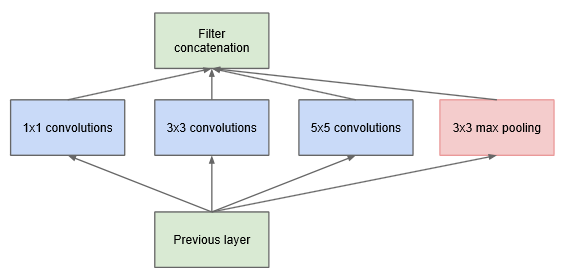
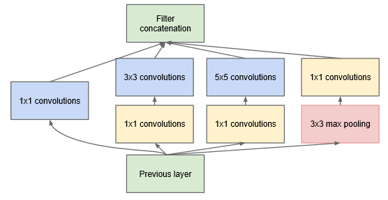

这部分是关于 GoogLeNet 系列网络的两篇论文，涵盖了 Inception v1 到 v3。作为 CNN 发展进程中经典的模型，它通过大量实验思考总结了很多关于 CNN 在设计方面应当注意的事项，尽管没有 VGG 那般简洁好用易训练，而且工程设计感很浓重，但其中涉及到的各种实验和结果都是实打实的，对这些实验的解读可以印证和加深自己对深度神经网络的理解，建议参考原文。  

Going deeper with convolutions:   
https://arxiv.org/pdf/1409.4842.pdf  

Rethinking the Inception Architecture for Computer Vision:  
https://arxiv.org/pdf/1512.00567.pdf  

<!--more-->
 
## Going deeper with convolutions
----------------------------------
#### 介绍
- 介绍一种新的结构, __Inception__, 想法基于Hebbian principle和multi-scale processing的直觉, 可以在保持计算量恒定下加深和加宽网络
- ILSVRC 2014: 相比AlexNet, GoogLeNet取得小12倍的参数以及高准确率

#### 动机和思考
- 性能瓶颈, 增强性能要增加模型大小, 但又加大了过拟合可能以及对数据的需求和计算量
- 解决之根在于稀疏化结构, 联合 Hebbian principle (`neurons that fire together, wire together`) : 
> Their main result states that if the probability distribution of the data-set is representable by a large, very sparse deep neural network, then the optimal network topology can be constructed layer by layer by analyzing the correlation statistics of the activations of the last layer and clustering neurons with highly correlated outputs.  ( : _"Provable bounds for learning some deep representations"_ )
- 问题在于当前计算设备对非固定形状的稀疏矩阵的数值计算不够高效. 使用 lookups 和 cache 带来的巨大开销使得稀疏计算得不偿失. 那么是否能够利用计算设备对 dense matrices 高效计算的优势, 在稀疏的架构上进行 dense matrices 的计算? 大量文献表明: 
> clustering sparse matrices into relatively dense submatrices tends to give state of the art practical performance for sparse matrix multiplication. ( : _"On two-dimensional sparse matrix partitioning: Models, methods, and a recipe."_  )

 相信不久的未来类似的方法会应用到自动构建的非固定形状的深度学习架构上
- 还有一个问题, 尽管推出的结构在计算机视觉上取得了成功, 但仍然有疑惑这种成功是否能归因于指导这种网络构建的思想. 这个问题即是在于自动系统是否能使用相似的算法在其他领域创建一个总体架构看上去相差很远, 但有相似的增益效果的网络拓扑

#### 结构细节
- Inception 核心思想基于如何在卷积视觉网络中找到最优局部稀疏结构, 这种结构能被 dense components 近似和覆盖
- 上层多输入聚合到下层单输出, 能够被1x1卷积表示, 加上大卷积聚合多尺度区域, 为了方便, Inception 取 1x1 3x3 和 5x5, 加入额外的并行pooling 通道也会对效果有所帮助.
- 高层后空间聚合需要减少, 于是要提高 3x3 5x5 卷积的比例

  

- 为了不让后期 5x5 与 pooling聚合(限定输入输出同 channel ) 导致的计算量高昂, 加入 1x1 卷积降维 ( `even low dimensional embeddings might contain a lot of information about a relatively large image patch` )

  

#### 训练细节
> Still, one prescription that was verified to work very well after the competition includes sampling of various sized patches of the image whose size is distributed evenly between 8% and 100% of the image area and whose aspect ratio is chosen randomly between 3/4 and 4/3. Also, we found that the photometric distortions by Andrew Howard [8] were useful to combat overfitting to some extent.

#### 最后
该结构在detection中也很有竞争力, 尽管没有做其他优化, 说明 Inception 结构的有效性, 会启发以后的模型结构趋向于 sparse. 

 
 
### Rethinking the Inception Architecture for Computer Vision
-----------------------------------------
#### 原文理解
##### 介绍:  
  - 上一篇文章提出的 Inception 略复杂很难去修改网络, 如果只是简单地加大网络会导致计算性能优势瞬间消失. 而且上一篇文章并没有详细表明设计时各部分的影响因素, 所以很难让它用于新的领域同时保持高效率. 比如, 如果要加 Inception-style 的网络的容量, 最简单的只能加倍滤波器数量, 但这样会导致计算量和参数的4倍增加. 这很不友好, 特别如果效果甚微的话.
  - 所以这篇文章开始讲述一些通用的原理和优化 ideas, 这些都是已经验证过对高效加大网络有用的方法.
  - 广义上的 Inception-style 结构的搭建对这些约束是可以比较灵活自然的. 这是因为它大量使用了降维和并行结构, 这让它减轻了临近结构改变带来的影响. 当然, 为了保持模型的高质量, 使用 Inception 还是需要遵循一些指导原则.

##### 通用设计原理:
这里会描述一些通过对不同结构的 CNN 的大规模实验验证过的设计原理. 尽管有点投机的意味, 但严重背离这些原则趋向于恶化网络的质量, 改了之后一般都会有所提升. 
1. 避免表达瓶颈 ( representational bottlenecks ), 特别是在网络的早期. 前向网络能表达为一个信息由输入到分类或回归器的有向无环图 ( acyclic graph ), 所以信息流方向是确定的, 输入到输出之间存在大量信息, 应该避免因极度压缩导致的瓶颈. 一般 表征 ( representation ) 的大小应该由输入到输出平缓地降低直到得到要直接用于任务的大小. 理论上, 信息内容不能仅仅以表征的维度来评判, 因为它舍弃了比如关联结构 ( correlation structure ) 等重要因素；维度仅仅用于提供信息内容的粗略估计. 
2. 高维表征更容易在网络局部中被处理. 增加每个卷积网络的 tile 的 activations 允许更多的解开的 ( disentangled ) 特征, 能加快网络训练.
3. 空间聚合能通过较低维嵌入完成, 而且还不会损失表达力. 比如, 在进行一个更分散 ( more spread out ) 的卷积 ( 比如3x3 ) 之前, 在空间聚合之前降低输入表征的维度不会导致严重的不良影响. 我们推测临近的单元存在很强的关联, 如果输出是用于空间聚合的话, 导致降维损失的信息会很少. 鉴于这些信号应该很容易压缩，维度的减小甚至加快了学习.
4. 平衡网络的宽度. 最优化网络的性能可以通过平衡每阶段的滤波器的数量和网络的深度来完成. 增加宽度和深度会使网络更高质量, 但要恒定计算量最优化提升需要两者并行增加. 计算预算因此应该用于平衡网络深度和宽度.  

尽管好像挺有道理, 但以上的原则并不能直接拿来即用, 仅仅用在模棱两可的情况下会比较明智.
##### 分解卷积:
1. __分解成小卷积: __通过使用临近结果将 5x5 分解成两个 3x3, 并在分解卷积间使用非线性激活.
2. __非对称卷积: __将 nxn 卷积分解成 1xn + nx1 卷积可以进一步分解卷积, 但该方法在网络刚开始的地方不那么 work well, 但在中等大小的 feature map ( mxm 大小,  m 在 12 到 20 之间 ) 上能取得很好的效果, 这种时候使用 1x7 和 7x1 卷积能达到很好的效果.

##### 辅助分类器的效用
发现 辅助分类器存在与否在模型达到高准确率之前没有影响, 两者训练过程几乎完全相同. 只有在接近训练的尾声时, 带有辅助分类器的模型才会超过没有辅助分类器的模型, 最终达到一个稍高一点的收敛结果.
此外, 此前的 GoogLeNet 使用了两个辅助分类器, 而接近输入端的辅助分类器实际上去掉也不会有负面影响. 所以之前关于它们对低层特征的帮助的假设更可能时错误的. 不过作者认为辅助分类器发挥了正则化的作用, 因为主分类器的性能会由于旁路实施了 batch-normalized 或者 dropout. 
##### 高效的网格缩小
传统的卷积网络用 pooling 来减少特征图网格大小, 为了避免表达瓶颈, 可以使用先拓宽维度再 pooling 的方法. 比如, 输入 d x d 大小 k 通道, 输出  d/2 x d/2 大小 2k 通道, 那就先做 2k stride 1 的卷积, 然后再接上 pooling. 但这样计算消耗太大, 于是作者提出分成两支, 使用 stride 2 并行 pooling 和 卷积, 最后 concat 在一起.
##### Inception-v2
基于上述内容作者提出了改进版的 Inception, 网络大致变化是:
1. 开局 7x7 变成 3 个 3x3. 
2. Inception 分成三类: 
  - 第一类用于 35x35 的 feature map, 即分解 5x5 后的传统 Inception
  - 第二类用于 17x17 的 feature map, 即非对称卷积版 Inception, 卷积核采用 7x7 大小
  - 第三类用于 8x8 高维特征的 feature map, 即使用并行非对称卷积加大宽度后的 Inception
3. 每类 Inception 间采用上述的高效的网格缩小方法

##### 使用 Label Smoothing 正则化模型
一般 label 是离散且 one-hot 的, 而使用最小化 cross entropy 来训练的模型的话相当于对 label 做最大拟然估计, 其数学形式是 Dirac delta :   
$$q(k)=\delta_{k,y}$$
在有限参数的情况下这是无法实现完全拟合的, 但模型却会趋向于这种形式, 这会导致两个问题: 一是不能保证泛化性能导致过拟合, 二是这种方式鼓励加大正确的预测和其他不正确预测之间的间隔, 加上在冲激处很大的梯度, 会导致模型的适应力下降. 直观来说就是对其预测太过自信了.  
为了降低模型的自信, 可以采用一个很简单的方法, 即将 label 的分布函数  
$$q(k|x)=\delta_{k,y}$$  
改成  
$$q'(k|x)=(1-\epsilon)\delta_{k,y}+\epsilon u(k)$$
就是混上了一个固定的分布函数 u(k), 再经过平滑因子 ϵ 权重. 作者此处使用了平均分布 u(k)=1/K, 所以
$$q'(k|x)=(1-\epsilon)\delta_{k,y}+\frac{\epsilon}{K} $$
这样每个 k 都有一个最低值, 而最高值的影响被平滑影响. 在损失函数的角度上看也可以认为 u(k) 提供了正则化项.
在 ILSVRC 2012 中, 作者采用了 u(k) = 1/1000 以及 ϵ = 0.1. 最终得到了恒定的 0.2% 的 top-1 和 top-5 效果提升.
##### 低分辨率输入的性能
为了比较不同输入分辨率对精准度的影响, 作者做个实验. 对三种输入分出三种网络配置 ( 为了公平对比保持计算量恒定) : 
1. 299 × 299 receptive field with __stride 2__ and maximum pooling after the first layer.
2. 151 × 151 receptive field with __stride 1__ and maximum pooling after the first layer.
3. 79 × 79 receptive field with __stride 1__ and __without__ pooling after the first layer.

结果如下:

|Receptive Field Size | Top-1 Accuracy (single frame) |
|:-------:|:------:|
|79 × 79 | 75.2%|
|151 × 151 | 76.4%|
|299 × 299 | 76.6%|

