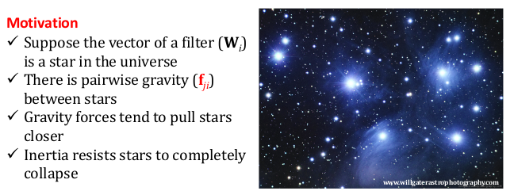
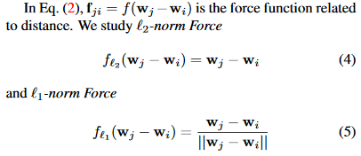
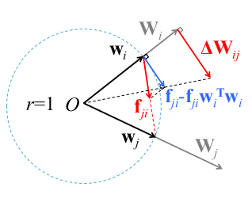

  

这篇论文是在学习压缩模型时无意中看到的，发表在 ICCV 2017。因为看到它的 motivation 觉得挺有意思的（昴星团瞩目），刚好还有代码，于是就学习了一下，顺带看看能不能用在项目上。  

原文链接： [Coordinating Filters for Faster Deep Neural Networks](https://arxiv.org/abs/1703.09746)
<!--more-->
### 原文理解
- 压缩和加速 DNN 模型的工作
- 常规压缩 _sparsity-based_ 方法 _Low-Rank Approximations ( LRA )_:
  -  可以不必经过仔细的硬件/软件设计就能压缩和加速 DNN
  -  原理在于滤波器之间冗余(相关性), 把大的矩阵近似成两个小矩阵相乘
  -  此工作专注于压缩已经训练好的模型来达到最大化减小计算复杂性, 然后 retrain 来保持精度
-  本工作注重训练出 _Lower-Rank Space_ 的 DNN, 提出了 _Force Regularization_:
  -  主要是通过引入额外梯度 ( _attractive forces_ ) 微调参数来增强滤波器的相关性, 从而使得 LRA 后能获得更小的参数量

### 方法
首先介绍 cross-filter LRA :  
LRA 为将大矩阵 
$$W\in\mathbb{R}^{N \times C \times H \times W}$$ 
分解为一个低秩矩阵和一个1x1的卷积偏移
$$\beta_m\in\mathbb{R}^{M \times C \times H \times W}, b\in\mathbb{R}^{1 \times C \times H \times W}$$ 
那么输出的 feature map 为:  

 $$O_n\approx(\sum^M_{m=1}b_m^{(n)}\beta_m)*I = \sum^M_{m=1}(b_m^{(n)}F_m)$$  

这里的 
$$F_m = \beta_m * I$$ 
所以输出即低秩矩阵与输入的卷积的线性组合  

然后是 _Force Regularization_:  
从数学层面上看 _Force Regularization_
$$\Delta W_i = \sum^N_{j=1}\Delta W_{ij} = ||W_i||\sum^N_{j=1}(f_{ji}-f_{ji}w_i^Tw_i)$$
$$W_i \gets W_i-\eta \cdot (\frac{\partial E(W)}{\partial W_i}-\lambda_s \cdot \Delta W_i)$$
这里E(W)为损失，λs 为 trade off 因子，\\(f_{ji}\\) 如下：  

  
  

在物理层面上看 _Force Regularization_ , 像是引力将参数聚集在一起
> Suppose each vector \\(w_i\\) is a rigid stick and there is a particle fixed atthe endpoint. The particle has unit mass, and the stick is massless and can freely spin around the origin. Given the pair-wise attractive forces (e.g.,universal gravitation) f_ji, Eq. (2) is the acceleration of particle \\(i\\). As the forces are attractive, neighbor particles tend to spin around the origin to assemble together.  

作者认为, 增加 _Force Regularization_ 可以让一簇滤波器趋向于有相同的方向, 而由于数据损失梯度的存在使得该正则项不影响原本滤波器提取有判别力的特征的能力(存疑)

### 实验
实验使用 baseline 作为 pretrained model. 原因是在相同最大迭代次数下, 从 baseline 开始训练比从头开始要有更好的精准度和速度提升的tradeoff, 因为 pretrained model 提供了精准度和高关联性的初始化条件.  

实验结论:
- _Force Regularization_ 能在低层卷积保持低秩特性, 然后在高层卷积时有很大的压缩, 总体上看 rank ratio (低秩和全秩比) 大约为50%.  
- L2norm 在高 rank ratio 时表现得比较好, L1norm 在潜在低 rank ratio 时表现得更好.
