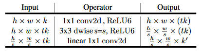
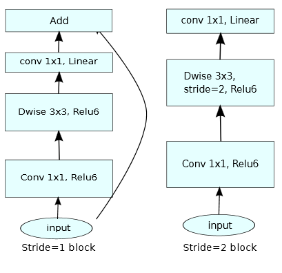
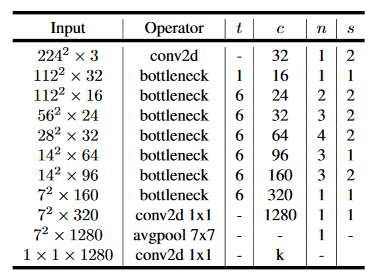

这是关于轻量级网络 MobileNet 的改进版论文，作为万众瞩目的高效率骨干网络架构，它的更新意味着移动端网络的又一次改进。  
原文链接： [Inverted Residuals and Linear Bottlenecks: Mobile Networks for Classification, Detection and Segmentation](https://arxiv.org/pdf/1801.04381.pdf)
<!--more-->
### Main Contribution
inverted residual with linear bottleneck. 输入低维压缩表征, 扩增到高维并进行 depthwise 卷积, 再通过线性卷积投射回低维表征.    
该卷积结构因为不需要完全实现大的中间 feature map, 还能显著降低内存占用  
### Pre-Knowledge
1. Depthwise Separable Convolutions  
广泛应用的标准卷积替代品. 将标准卷积分解为两部分, 第一部分为 _depthwise convolution_, 即每一个输入通道使用对应的一个卷积核来滤波, 第二部分为 _pointwise convolution_, 即使用 1x1 卷积将上层特征线性组合得出新的特征.  
\\(d_o\\) 个 \\(k \cdot k\\) 标准卷积花费 \\(h_i\cdot w_i\cdot d_i\cdot d_o\cdot k^2\\), 而相对应的 depthwise 分离卷积花费 \\(h_i\cdot w_i\cdot d_i\cdot k^2 + h_i\cdot w_i\cdot d_i\cdot d_o\\), 相当于减少了近 \\(k^2\\) 倍的计算量 ( 实际是乘了 \\(\frac{1}{d_o}+\frac{1}{k^2}\\) 倍 )

2. Linear Bottlenecks  
这里讨论激活层的基本属性, 文中将激活层的 feature map 看作维度 \\(h_i\times w_i\times d_i\\) 的激活张量.   
正式来说, 对于 \\(L_i\\) 层, 输入一组图像, 其激活组成了一个 " manifold of interest " ( 感兴趣流形? )  
这里提出了关于 manifold of interest 的一些假设, 并通过实验证明在 bottleneck 中使用非线性会损坏信息, 给出了通过在卷积 block 内插入 linear bottleneck 可以达到 capture 低维 manifold of interest 的目的  
 
3. Inverted residuals  
受 bottlenecks 实际上包含所有必要信息的直觉启发, 文中直接将 bottlenecks 间作为 shortcuts  
最终该设计网络的层可以去除而不需要重新训练, 只减少一点点准确率

4. 信息流的解释  
文中阐述了该结构能将 building blocks 的输入和输出域很自然的分割开来, 作为网络每层的容量, 以及输入输出间的非线性函数作为表达力 ?  

### Architecture
Bottleneck & Network:  

在作者实验中, t 在 5~10 之间得出的结果大部分差不多, 只是在小网络中小的 t 值会稍微好一点, 大的网络中大的 t 值会稍微好一点  
在整体网络结构中, 第一个 bottleneck t 值为 1 会比较好, 另外在小的网络宽度下, 保留最后几层卷积层的卷积核数会提高小网络的性能  

### Implementation Notes
这部分主要是关于推理时内存占用的优化问题, 大致来讲, 传统的结构的内存占用由并行结构主导 ( 即残差连接之类的 ), 而这类结构需要内存为通过计算的输入和输出 tensor 的总和  
而文中提出的 building block 的内部操作均为 per-channel 的, 且随后的非 per-channel 操作具有很大的输入输出 size 比率 ( 即 bottleneck 的输入 channel 显著大于输出时的 channel ). 这样在内部操作中需要的内存占用仅仅为一个 channel 的 size, 而输出残差连接也因为 Invert Residual 减少了 channel 从而减少内存占用  

### Experiments
比较关心分割方面的, 所以这里只记录关于分割的实验  
实验在 PASCAL VOC 2012 上进行, 主要是比较各种 feature extractors 下的 DeepLab V3, 以及简化 DeepLab V3 的方法, 推理时采取不同的策略来提升性能. 结论如下  
1. 推理策略加入 multi-scale 和 left-right flipped 会显著地增加计算量, 所以在终端设备应用上不考虑
2. output_stride 为 16 比 8 更高效
3. 在倒数第二层基础上做 DeepLab V3 会更高效, 因为 channel 小, 而且得到的性能相似
4. 去掉 ASPP 会减小很多计算量而且只损失一点性能 ___( ASPP 没有进行 depth-wise 改进, 参见 DeepLab V3, 所以该结论在优化后的 ASPP 上实际效果存疑 )___

### Ablation study
两个方面
1. Invert residual connections 的有效性
2. 违反常理的 linear bottleneck 能提升性能, 给 non-linearity 操作在 bottleneck 低维空间内损失信息的假设提供了支持

