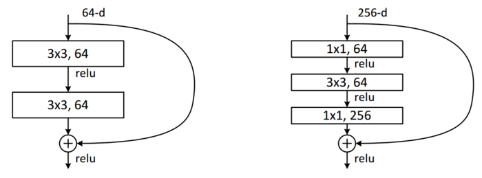
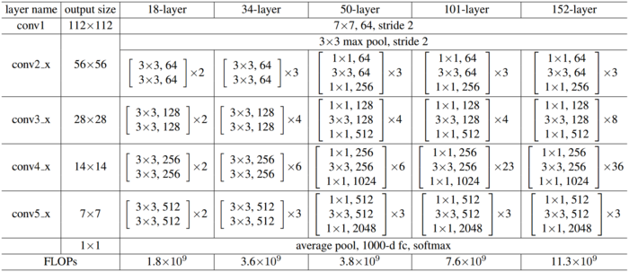

这里是 ResNet 的论文，作为被广泛应用的骨干网络，它提出的几个概念可以说是__着实可靠__地拓宽了网络设计的思路，对于广大摸着石头过河的工程师和研究者来说就是指出了一条明路。网络本身也高效、简洁且实用，可以作为 VGG 的上位替代。
<!--more-->
## Deep Residual Learning for Image Recognition
--------------------------------------
#### 原文理解
##### 介绍
网络深度对很多视觉任务都有很强的重要性, 但是仅靠简单的层堆积会存在梯度消失/爆炸问题. 虽然使用一些归一化初始技巧和中间归一化层可以很大程度解决这些问题, 但随着深度继续增加, 网络的精准度会逐渐饱和, 接着就会快速劣化, 这就是 _degradation problem_. 出乎意料的是, 这些问题不是因为过拟合导致的, 实验证明增加更多的层数会导致更高的 _训练误差_.  
本文, 作者通过引入一个深度残差学习框架解决了这个 degradation problem. 与其让每几个堆叠的层直接学习潜在的映射, 我们显式地让这些层去学习残差映射. 正式来讲, 即输出 H(x), 输入 x, 让非线性层学习 F(x):=H(x)-x, 那么原本的映射就变成了 F(x)+x. 这在前向网络中会被视为捷径 ( "_shortcut connections_" ), 允许网络跳级连接, 在本文中可以简单看成 _恒等映射 ( "identity mapping" )_.  
经过实验发现, 深度残差网很容易训练, 且很容易让精度随网络深度的增加而增加.  
##### 残差学习
假设多次非线性函数能够渐进逼近复杂函数, 那么在维度不变的情况下该假设与渐进逼近残差是一样的.  
之所以改为学习残差, 是因为 degradation problem 这个反常的现象. 在残差学习的恒等映射情况下, 一个更深的模型的训练误差是应该不超过比它浅的模型的. degradation problem 告诉我们 solver 使用多次非线性函数在渐进逼近恒等映射时可能存在困难, 而残差学习则提供了将权重趋向 0 来达到恒等映射的拟合.  
当然, 在现实中, 恒等映射不太可能是最优的. 但这个改动可能有助于先决这个问题. 如果最优函数接近于恒等映射而非零映射, 那么 solver 应该很容易学习扰动来得到最优函数. 通过实验发现, 通常残差函数只有很小的响应, 这表明恒等映射的可以提供合理的先决条件.
##### shortcut 恒等映射
本文采用每叠一些层就使用残差学习, 也就是建立一个 block:
$$y=F(x,W)+x$$
其中:
$$F = W_2\sigma(W_1x)$$
σ 为 ReLU, 省略了 bias. 在得到 y 后再做一次 ReLU.  
如果需要变化维度, 则:
$$y=F(x,W)+W_sx$$
W_s 为投影矩阵, 用来改变维度, 当然它也可以是个方阵用作线性变换, 但后续实验证明恒等变换就足够解决 degradation problem 了.  
F 是可以灵活改变的, 可以含有多层, 或者不同类型的层, 比如卷积层. 但如果 F 仅含有一层映射的话, 那还没有得到有效的效果验证.
##### 网络结构
为了对比, 作者构建了两个相同计算量的网络, 两种网络均为类似 VGG 的网络. 开始 7x7 stride 2, 然后 3x3, 每降低一次 feature map, double 一次 filters 数量, 使用 stride 2 卷积来降低 feature map, 堆叠 34 层和类似的 18 层. 最后做全局平均池化, 然后接 1000 分类器, 卷积后面都采用了 batch normalization 保证训练不失败.  
不同的是 ResNet 版加入了跳级连接, 降低 feature map 提升维度处分成两种策略, 一种填充 0 来扩增维度, 另一种上述提到的 1x1 升维, 两种方法都 stride 2 降低空间大小.  
实验得知, VGG 34 层表现比 18 层要差. 而且经过更多 iter 的训练发现问题没有解决.  
对于 ResNet 版, 采取第一种策略的, 34 层比 18 层错误率要少 2.8%, 更重要的, 34 层表现出明显更低的训练误差, 并且能很好泛化验证数据.  
对比两种网络的 18 层版, 发现 ResNet 能在训练早期更快的收敛.  

ImageNet 上 10-crop top-1 error 实验结果如下:

  | plain | ResNet
:------:|:------:|:------:
18 layers | 27.94 | 27.88
34 layers | 28.54 | 25.03
(PS: _看上去似乎浅层下 ResNet 影响不大_)

##### 恒等和投影 shortcuts
对比 ResNet 不同策略, 分为三种对比: 
1. 零填充升维, 所有 shortcuts 都没有参数
2. 升维时使用 1x1 卷积升维, 其他恒等
3. 所有 shortcuts 都带有 1x1 卷积  
实验表明, 2 稍微比 1 好些 `(top-1 25.03->24.52)`, 作者认为这是因为 1 在升维时的零填充部分实际并没有进行残差学习; 3 轻微比 2 好些 `(top-1 24.52->24.19)`, 作者认为这是因为 3 在 shortcuts 处引入了额外参数.  微小的差异表明投影 shortcuts 对与解决 degradation problem 不重要. 

##### 更深的瓶颈结构
为了节省训练时间, 作者把上面的 block 修改为 瓶颈 ( _bottleneck_ )  设计. 即在每个 $F$ 内堆叠三层, 分别为 1x1, 3x3, 1x1 卷积层. 其中 1x1 用于升降维度, 使 3x3 作为有更低输入输出维度的瓶颈.  

  

对于瓶颈结构来说, shortcuts 策略的选择对模型大小和时间复杂度都有很重要的影响, 无参数恒等 shortcuts 可以让瓶颈模型更高效. (_`?`_)   
作者在 50/101/152 层模型中使用了瓶颈结构和策略2的升降维.其各个配置如下:   

  

(PS: _值得注意的是 ResNet 50 层瓶颈版的 FLOPs 与 34 层相差不大, 网络的堆叠配置是一样的_)

在 ImageNet 验证集上的 10-crop 实验结果如下:

method | top-1 err. | top-5 err.
:------:|:---------:|:--------:
plain-34 | 28.54 | 10.02
ResNet-34 1 | 25.03 | 7.76
ResNet-34 2 | 24.52 | 7.46
ResNet-34 3 | 24.19 | 7.40
ResNet-50 | 22.85 | 6.71
ResNet-101 | 21.75 | 6.05
ResNet-152 | 21.43 | 5.71

在 ImageNet 验证集上单模型实验结果如下: 

method | top-1 err. | top-5 err.
:------:|:---------:|:--------:
ResNet-34 2 | 21.84 | 5.71
ResNet-34 3 | 21.53 | 5.60
ResNet-50 | 20.74 | 5.25
ResNet-101 | 19.87 | 4.60
ResNet-152 | 19.38 | 4.49
最终在 ILSVRC 2015 提交中使用了两个 152 层模型的 ensembles, 得到 top-5 error 3.57.

