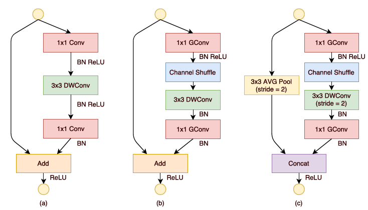

这部分是关于轻量级网络 ShuffleNet 的论文记录，主要是基于 channel shuffle 的想法来减少 CNN 中占大头的 1x1 卷积的计算量。
<!--more-->
### ShuffleNet: An Extremely Efficient Convolutional Neural Network for Mobile Devices
---------------------------------
#### 原文理解
介绍一种极其计算高效的 CNN 结构 ShuffleNet, 计算量可以控制在 10-150M FLOPs, 利用了 1x1 group conv, depth-wise conv 和 shuffle channel op.  
比起现有的方法专注于对基础网络进行 pruning, compressing, low-bit representing, 本文追求在非常有限的计算资源下 ( 几十或几百 MFLOPs ) 达到最好的效果. 目标是探索针对所需计算量范围定制非常高效的基础网络.  
ResNext 和 Xception 由于 1x1 dense 卷积过多在小网络中效率不高, 本文提出 _pointwise group convolution_ 减少 1x1 卷积的计算复杂度, 同时经过 _channel shuffle_ 来克服边缘效应
##### channel shuffle
在小网络下 1x1 卷积数量大很昂贵, 减少通道可能会对精度产生很大的损害. 最直观的解决方法是采用 channel sparse connections, 比如 group conv. 但这又导致输出部分仅与其相应输入的部分通道产生, 导致信息流通阻塞.  
通过 _channel shuffle_ : 输出 g x n 通道, 对输入先 reshape 到 (g, n), 转置然后 flatten. 可以优雅地解决问题.
##### ShuffleNet Unit
基于 bottleneck 的结构 (b) (c): 

  

为了简单, channel shuffle 只加在第一个 1x1 后. 由于在低功耗设备下 depth-wise conv 的 `computation/memory  access  ratio` 可能比 dense op 要差, 实际上并不能高效实施, 所以故意只在 bottleneck 中使用.
##### Network Architecture
参考设计: 类似 ResNet, bottleneck channel 是 output channel 的 1/4, 下层 channel 翻一倍.
在 ShuffleNet 中, 大致相同计算量下, 明显可以看出, group 数越大, output channel 就要越多, 这有助于 encode 更多信息, 尽管有可能会导致单个卷积滤波器的作用降级  
另外, 在第一次 point-wise conv 时不采用 group conv, 因为输入通道数相对较小
##### Experiments
和 MobileNet 一样, 这里训练使用了不那么 aggressive 的 scale augmentation, 因为小网络通常会欠拟合而不是过拟合 __( 本人在 ENet 的实验中也印证了这点 )__, 实验结论如下:
1. _pointwise group convolution_ 有效, group 比不 group 好, Smaller models tend to benefit more from groups.
2. 0.5x 情况下 group 比较大时会饱和, 准确率甚至下降. 但再减小 channel 到 0.25x, 发现增大 group 没有饱和, 反而收益更多了. __( 此处实验不充分, 不足以证明什么 )__
3. Channel Shuffle 很有效, 特别在大 group 时.
4. 实际加速由于内存访问等原因在移动平台上的呈现 理论加速 4 倍 = 实际加速 2.6 倍

