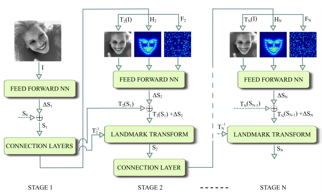
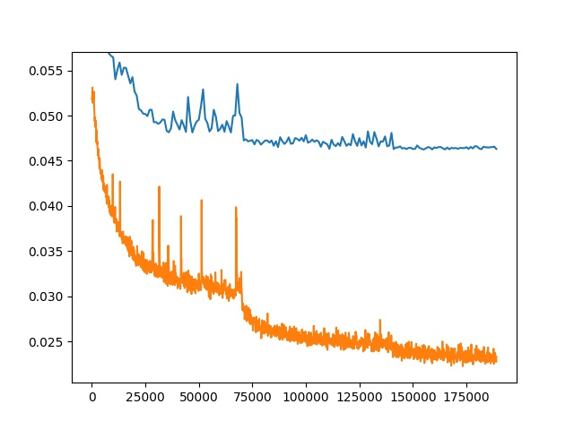
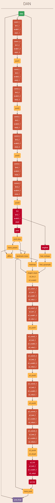

<figure align=center>

</figure>

这部分是去年 9 月份开始的工作，算是第一次真正踏入深度学习的领域。具体工作也还算简单，就是复现一篇深度学习方法做的人脸对齐，当练练手。
<!--more-->
### 引言
因为深度学习的发展，很多传统的计算机视觉技术有了突破性进展，市面上也涌现了不少以前技术无法做到的产品，传统的像人脸检测、人脸对齐方面也有很大进步。这里就谈谈其中的一个，Deep Alignment Network [1]（下面简写 DAN）。  

DAN 是用卷积神经网络做人脸对齐的工作，大致思想就是级联卷积神经网络，每阶段都包含前一阶段的输出作为输入，输出 bias，加上 bias 并摆正人脸关键点和输入图，用 输出点生成的 heatmap + 最后一层卷积输出的特征 reshape 图 + 摆正后的原图 作为下一阶段的输入。这样就能不断修正，以达到 robust 的结果。  

### 实现
作者在 GitHub 上开源了代码 [2]，用的是 Theano 实现。除了验证集设置、initshape 部分冗余 和 测试的部分代码 外，其他部分应该都是没问题的，直接训练得到的结果除了 Challenging subset 稍微要差一些外，其他都和论文一致，算是比较好复现的一个了。  

我用的是 caffe 做复现，一方面是方便部署到安卓，另一方面是简单好用，改起来也容易。当时还没有 TensorFlow Lite，从各个方面来说 TensorFlow 都不太方便。当然，现在 TensorFlow 就更厉害了。  

大体上要做的事就是先实现一阶段，写好方便训练、测试用的 python 代码，把数据集封装成 hdf5。因为一阶段没用到自定义层，所以直接写出网络结构的 prototxt 和 solver 就能训练了，训练好后就能作为二阶的 pre-trained model。当然一阶相当于直接 VGG + 回归输出，所以也可以直接看到效果了，我训练出来测试结果如下（测试方法对应代码里的 centers，也就是 inter-pupil normalization error）:  

|Full set (%)|Common subset (%)|Challenging subset (%)|
|:----:|:----:|:----:|
|6.09|5.29|9.37|  

因为训练过程稍有不同，参数也没怎么调，而且后面发现 heatmap 有一点小问题，这个结果和原代码一阶训练的结果有些差异（AUC 差大约 3%），不过无妨，这个结果已经比传统的方法要强得多了，我们继续二阶训练。  

二阶大部分代码可以和一阶共用，主要要做的部分就是把论文提到的几个自定义层实现，对应这四个地方：
1. 根据第一阶预测的结果和 mean shape 对比求出仿射变换参数
2. 根据仿射变换参数对输入图做仿射变换，也就是对正原图啦
3. 根据仿射变换参数对第一阶预测的结果做仿射变换，当然还要包括反变换的实现
4. 根据对正的一阶预测结果产生 heatmap  

然后还有一些 caffe 不支持的又比较常用的层，也就是 resize 层（也有叫 Interp 层或者 upsample 层，都是做插值，我个人认为最好用和部署框架相同的算法）。还有 loss 层，这个会影响到测试的结果和实际效果，我用的是和测试方法一致的度量来做 loss。  

写好这些层的代码后还有两件事要做。一是单独测试每一层的输出，确保每层前向都各自没问题；二是要做 gradient check，保证反向传播的梯度数值正确。  

完成一切之后，用一阶段模型作 pre-trained model，进行训练：

  
训练过程

### 结果

最终结果：  

|Full set (%)|Common subset (%)|Challenging subset (%)|
|:----:|:----:|:----:|
|5.02|4.30|7.95|  

可以看到和论文结果已经很接近了，这个任务也就大致完成了。比较遗憾的是这个网络不太好替换，后来我尝试把 backbone 从 VGG 更换成其他的轻量型网络，效果都不太理想，而且一到二阶段时由于三张原尺寸图 concat 做输入导致网络参数和运算量剧增也是一个很大的问题。另外，训练过程也可以看到存在非常大的过拟合。虽然有很多地方可以改进，不过毕竟不是首要的研发项目，所以后面就没有做下去了。

整个网络的结构框图如下：
<figure align=center>

</figure>

[参考文献]:  
[1] [《Deep Alignment Network: A convolutional neural network for robust face alignment》](https://arxiv.org/pdf/1706.01789.pdf)  
[2] github: [MarekKowalski/DeepAlignmentNetwork
](https://github.com/MarekKowalski/DeepAlignmentNetwork)  

