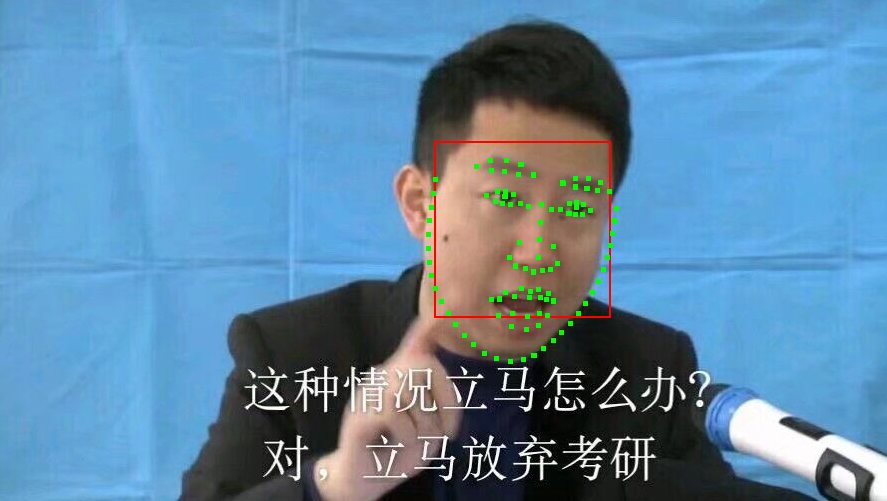
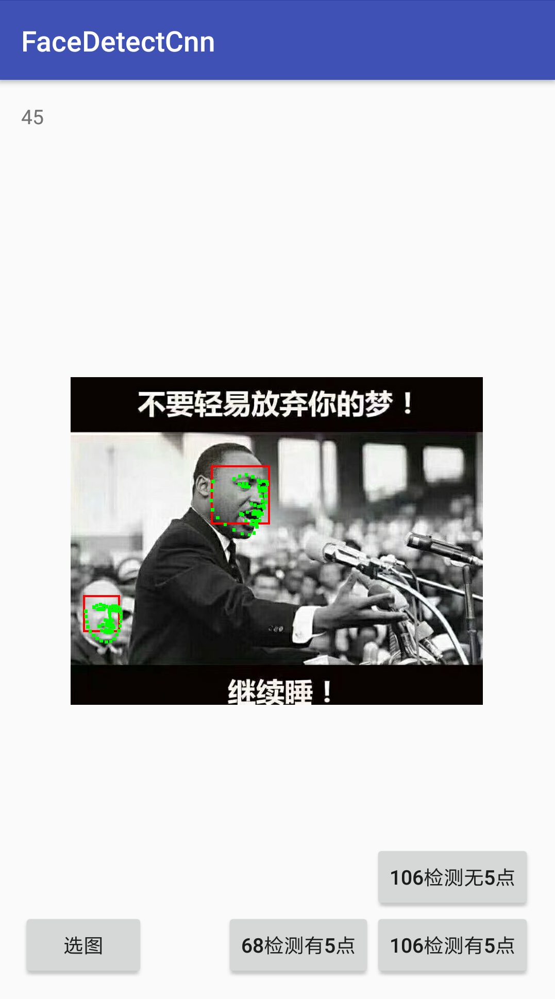

  

尽管是在复习备战阶段，不过还是要时常回顾一下之前工作的经验，不能太过生疏。  
这里是关于应用传统方法做人脸对齐的经验总结，是在去年5月到7月的工作，也是我入职后的第一个正式项目，用的是 SDM (Supervised Descent Method) [1] 的方法，具体细节可能不太记得，所以会慢慢补完。  
<!--more-->
### 引言
在深度学习杀到这领域前，有两种主流的人脸对齐方法，一个是14年的号称能达到 3000FPS 的 LBF，还有一种就是13年的 SDM。由于 3000fps 复现效果不理想，实际上 SDM 比起 3000fps 精度要高一些，而且还有不错的现成代码，当时也只是想把静态的人脸对齐做了，所以就选用了 SDM。 

关于 SDM，其实是作者提出的一种非线性最小二乘优化的方法，类似牛顿步等方法，只不过回避了需要大计算量的 Hessian 矩阵和 Jacobian 矩阵的计算，人脸对齐算是它的一种应用。论文中的大致意思就是从牛顿步出发想办法把那两矩阵裹起来改为用迭代回归来学习，得到下降方向和大小，关于它更多的理论理解部分在官网上有很简单直观的介绍，这里暂时先放着。  

### 实现过程
我用的是 github 上 patrikhuber[2] 的开源代码，这个版本比论文的 SDM 稍微改进了一些，不过当然无论是模型大小、运算速度还是算法效果，都远不足以应用。所以我花了不少时间看论文，并在源代码基础上实现了一大堆算法模块，然后不停训练。当然很多想法实际上并没有奏效。 

那段时间现在看起来是挺盲目的，想到什么加什么，甚至还纠结用 HOG 还是 DSIFT 做特征提取，还是两者混合 SDM 迭代时切换特征提取器。在诸如此类想法上花了不少工程上的功夫以达到能够随时切换配置做训练，更重要的是浪费了训练时间。实际上这些都不是制约最终效果的瓶颈，因为当时的特征提取的范围是限定的，瓶颈并不在于特征提取器本身，况且 HOG 和 DSIFT 本身差别并不大，在瓶颈时如果不找出瓶颈下功夫而着眼于其他不确定的想法往往是不明智的。  

其实那时候很多的想法可能并不是没有奏效，而是被瓶颈掩盖了，造成了想法无效的错觉。换句话说，我们做算法的常常要评判什么想法是有效的，什么想法是无效的，而我觉得这种评判是要有所保留的，可能之所以想法无效是因为被什么我们没看到的因素所制约了，暂时行不通罢了。  

扯远了，总之当时的瞎蒙乱撞最终幸运的还是找到了几个有用的改进方法。类似《Extended Supervised Descent Method for Robust Face Alignment》[3] 里提到的，一个是关于特征提取范围以及cell数量的改进，改成了顺应 SDM 迭代过程从大到小的范围、从粗到细的计算；第二个就是分开全局和局部来进行回归。这一些改进其实算是人脸对齐中比较常见的改进了，没有太多新意，不过对于全局和局部区分回归来说，比起对最终效果的改进，这个方法对模型大小和运算速度的改进更为明显。最后为了工程上的应用，这些方法都需要大量调参。  

完成上面的这些其实也提升不了太多，关于这个项目最终提升最大的还是加入了人脸检测时得到的 5 个点做先验。也就是把 5 点扩展到 68 点，再加点 trick 使这 68 点极其接近 ground truth，最后作为 init shape 输入到 SDM。这个方法让人脸对齐准确率和成功率大大增加，因为先验降低了回归的难度，把瓶颈推到了人脸检测时的五点回归成功率。虽然某些特殊情况可能会因为先验产生一些误导，不过也让通常情况下的对齐准确度达到非常高的地步，这是值得的。（后来我记得找到了一篇2017年7月的论文也有提到用类似我这个方法的改进版 SDM 和 LBF 来和他的深度学习方法对比的论文，只不过他用的是JDA，我用的是MTCNN，还有就是生成的 init shape 方法略有不同。）  

### 最终效果
至此，我的 SDM 人脸对齐的效果已经和当时竞品水平相当了，最终在 300w 上测试的结果为（用的 inter-pupil normalization error）  
  
|Full set (%)|Common subset (%)|Challenging subset (%)|
|:----:|:----:|:----:|
|4.75|4.09|7.47|  

当然了，因为这个测试数字是用了五点 ground truth 做抖动的前提下得到的，所以没严格的参考价值，无法和其他公开方法做比较，不过也能反映这种方法的有效性。   

最终做了三个模型，分别是有五点先验的 68 点、106 点，以及没有五点先验的 106 点。模型大小都是 5MB 左右， 在小米 mix2 上速度 20ms 左右。demo 效果大致如下：

<figure align=center>

</figure>  

### 结语
关于训练数据集其实还有非常多要写，比如我这里只用了 300-w 数据集，在这基础上翻转、模糊、调对比度，还有关于如何将 68 点数据集扩增到 106 点的，也参考复现了几篇论文。还有的话就是安卓端的部署，包括算法的移植、接口封装，运算速度的优化，模型的压缩等等。之后有空的话可能会整理补上。

[参考文献]:  
[1] [《Supervised Descent Method and its Applications to Face Alignment》](https://www.cv-foundation.org/openaccess/content_cvpr_2013/papers/Xiong_Supervised_Descent_Method_2013_CVPR_paper.pdf)  
[2] github: [patrikhuber/superviseddescent
](https://github.com/patrikhuber/superviseddescent)  
[3] [《Extended Supervised Descent Method for Robust Face Alignment》](http://pdfs.semanticscholar.org/5c82/0e47981d21c9dddde8d2f8020146e600368f.pdf)

