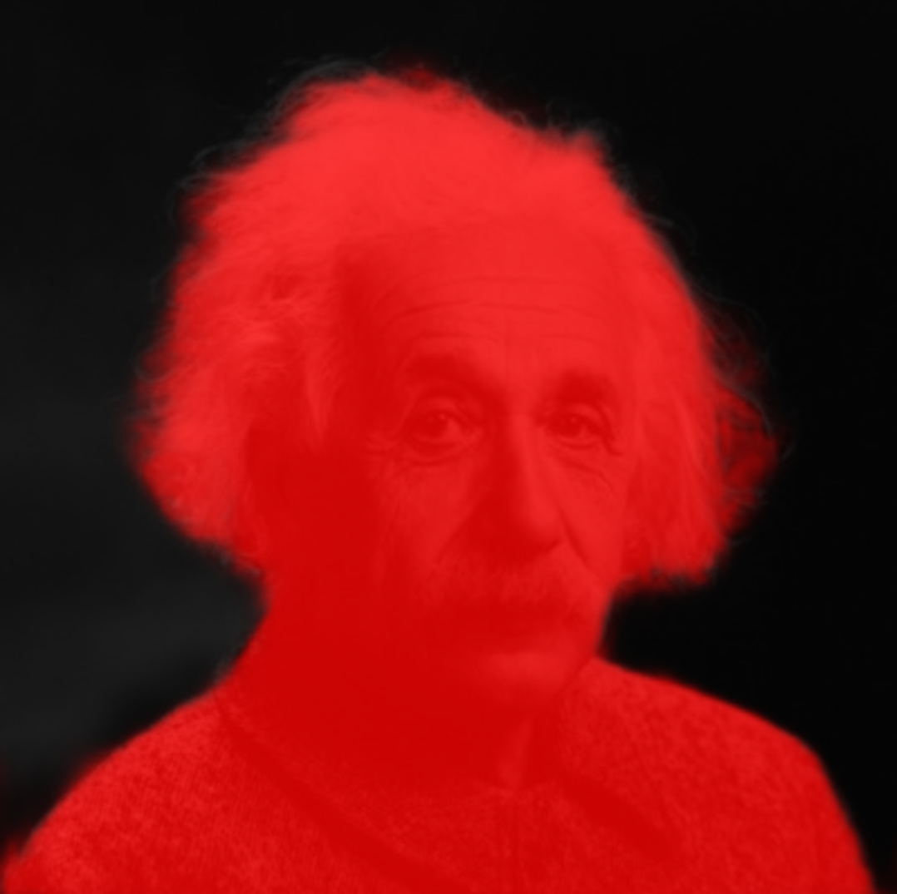
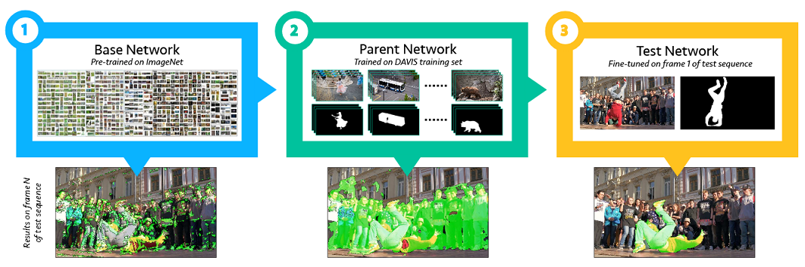
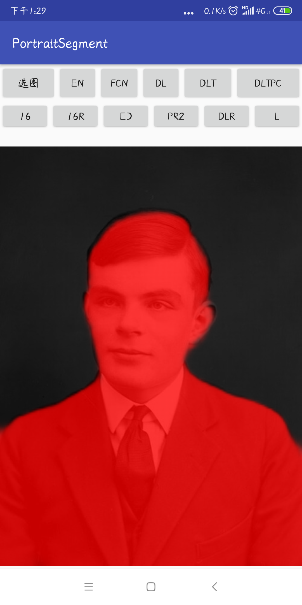
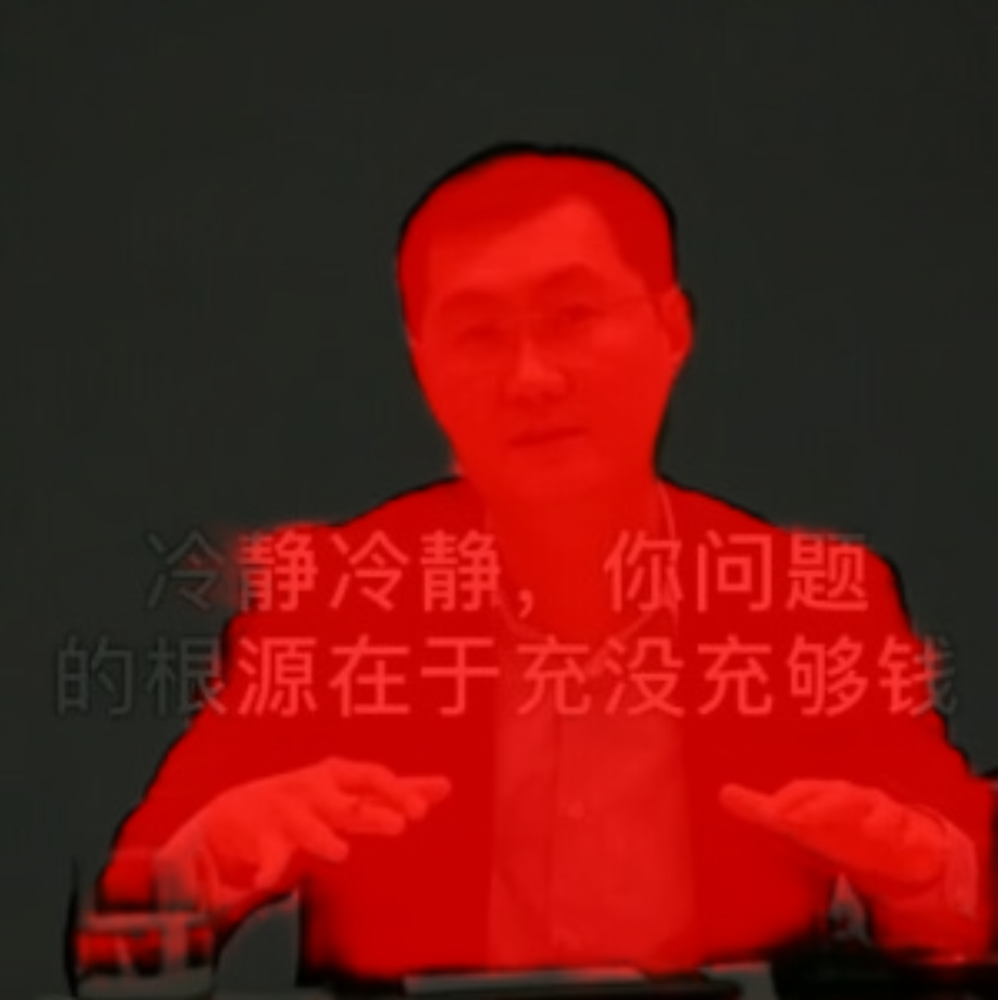
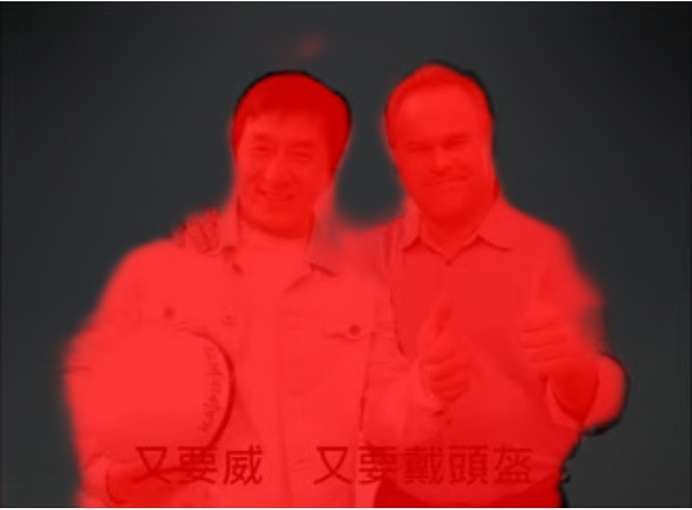

  

这部分是关于在低计算量下完成人像分割的工作，因为时间充裕，所以调查尝试得比较多，最终完成的效果还不错。
<!--more-->
## 引言
人像分割（portrait segmentation）属于语义分割的子集，某种程度上类似于只专注人的前景分割，可以看成是二分类的语义分割。不过这里的应用场景是半身肖像，对于效果的评价更加专注于分割边缘和细节的质量，现在看来这次的工作在这方面其实做得比较一般，只是就通常的 IoU 意义上来看还不错。 

总体来说，人像分割方面的论文比较少，典型的就是 Xiaoyong Shen 等人的工作 [1] [2]。不过实际尝试过程中发现，其中的很多技巧无法有效的应用于低计算量的场景中，固定先验的引入也会导致分割效果在某些情况下变差。  
## 实现
#### 数据集
数据集方面因为我采取了逐步迁移训练，多次 fine-tuning 的方式，所以需要从 ImageNet 到 COCO 人像子集再到标准半身人像分割的数据集。COCO 人像子集是从 COCO 中筛选出含人类（且占面积较大）的部分，大约 4 万张；半身人像分割的数据集训练集一千多张，验证集 50 张，测试集 300 张；还有一些私有的测试集。  
之所以这样做主要是因为最终用于应用场景的数据集过少，而且从 OSVOS[3] 等文中得到了更多的启发。

  
OSVOS 的做法

#### 设计
我主要尝试了 ENet [4]、FCN [5]、FCN dilated convolution 版本 [6]、UNet [7] 的改进版 以及 类 DeepLab V3+ [8] 中的方法。为了保持计算量，除了 [4] 外，我都采用了轻量化网络 ShuffleNet [9] 作为 backbone 来进行复现，大部分网络的输入限制为 224x224。  

对于 UNet 的改进版，因为是冲着实时而设计的，所以在 decoder 的设计上，尤其是底层特征的引入上显著减少了滤波器数量。当 output stride 为 4 时，可以得到的模型性能为：参数量 79.54K, FLOPS 24.44M, 访存量 46.98MB，可以达到实时。   

对于类 DeepLab V3+ 的版本，为了尽可能的压缩计算量，我最大限度的利用了 Depthwise Convolution、Dilation 以及 Channel Shuffle 的特性，同时为平衡精度将 output stride 限制为 2（损失非常少），decoder 也改成了更为节省计算量的简单版本，模型性能为：参数量 965.49K, FLOPS 743.37M, 访存量 392.87MB。  

> - _来自底层特征的 skip-connection 是有很明显的边缘细化效果的，但同时也十分容易过拟合，这是值得注意的问题。_ 
- _尽管我把 ASPP 写的很省，但尝试后发现如果那个结构不加 ASPP 的话性能会很差。_
- _关于深度，尝试的结果似乎说明了 Encoder 部分需要足够的深（至少 8 个 res block 是不够的），而 Decoder 则不需要太复杂（没有足够的证据，不过增加 2 层能带来的好处不大）_

#### 训练
训练方面，UNet（实时） 和 类 DeepLab V3+ 方法因为是从头搭起，所以就像上面说的一样，需要两次 fine-tuning，其余方法并没有经过 COCO 人像预训练。优化方法我用的是 SGD+Momentum，事实上这是因为用其他的一些优化方法会导致“零核现象”的发生，我在以前的一篇文章中分析过这点，不知道这个现象和性能的下降有多大关系，但如果用 SGD 的话就不会有这种事情发生，而且性能会更好。

> - _COCO 人像部分的预训练的加入很有效，但是必须使用和应用场景十分相似的部分作为预训练才有效，不筛选的话很可能没有效果上的影响。_  
- _使用大 Momentum（我用的 0.99）似乎不错，训练速度会很快而且效果也不会差（实验尝试似乎比 0.9 还要好）。_
-  _实际训练时还发现有挺严重的过拟合，所以做了些数据集扩增，结果挺有效的。_  
- _在 output stride 为 8 时增加一个辅助损失也是有效的。_

#### 测试

在 [1] 中给出的数据集中测试结果如下（其中我加入了 Std 度量用于观察分割的稳定性，意为 IoU 的标准差）

| Method | mIoU | Std |
|:----:|:----:|:----:|
| ENet | 94.04% | 6.25% |
| FCN | 95.73% | 3.10% |
| FCN + dilated | 96.04% | 3.27% |
| UNet（实时） | 95.32% | 4.03% |
| 类 DeepLab V3+ | 96.4% | 3.25% |
| PortraitFCN+[1] | 95.91% | - |

另外我还自己标了个五十多张明暗、运动、背景复杂度变化都比较大的测试图片，在此数据集上测试结果为

| Method | mIoU | Std |
|:----:|:----:|:----:|
| ENet | 61.42% | 20.04% |
| FCN | 87.71% | 12.01% |
| FCN + dilated | 89.43% | 10.62% |
| UNet（实时） | 91.96% | 3.95% |
| 类 DeepLab V3+ | 93.7% | 2.3% |

可以看到类 DeepLab V3+ 方法测试结果还是挺不错的，其余的多个私有测试集上表现也不错，它在 MIX2 上前向一张图片大概需要 120ms。除此之外，达到实时性能的 UNet 改进版也不错。

## 最终的效果 

  

可以看到边缘的跟踪还是不错的，除此之外，头发的细节处理也可以在顶部图中看到。  

因为 output stride 为 2 导致分割边缘在放大后加大了间隔，看上去和实际边缘有些距离。在下面的图中可以明显看到这种在人和物件之间的边界、甚至透明物件覆盖影响下算法的处理情况。

  

虽然训练集全都是单人肖像，但多人的情况也能够分割，具体效果还是要看人物所占的尺度等。  

  

[参考文献]:  
[1] [《Automatic Portrait Segmentation for Image Stylization》](http://xiaoyongshen.me/webpage_portrait/papers/portrait_eg16.pdf)  
[2] [《Automatic Real-time Background Cut for Portrait Videos》](https://arxiv.org/pdf/1704.08812.pdf)  
[3] [《One-Shot Video Object Segmentation》](http://openaccess.thecvf.com/content_cvpr_2017/papers/Caelles_One-Shot_Video_Object_CVPR_2017_paper.pdf)  
[4] [《ENet: A Deep Neural Network Architecture forReal-Time Semantic Segmentation》](https://arxiv.org/pdf/1606.02147.pdf)  
[5] [《Fully Convolutional Networks for Semantic Segmentation》](https://arxiv.org/pdf/1411.4038.pdf)  
[6] [《Understanding Convolution for Semantic Segmentation》](https://arxiv.org/pdf/1702.08502.pdf)  
[7] [《U-Net: Convolutional Networks for BiomedicalImage Segmentation》](https://arxiv.org/pdf/1505.04597.pdf)  
[8] [《Encoder-Decoder with Atrous SeparableConvolution for Semantic Image Segmentation》](https://arxiv.org/pdf/1802.02611.pdf)  
[9] [《ShuffleNet: An Extremely Efficient Convolutional Neural Network for MobileDevices》](https://arxiv.org/pdf/1707.01083.pdf)  

