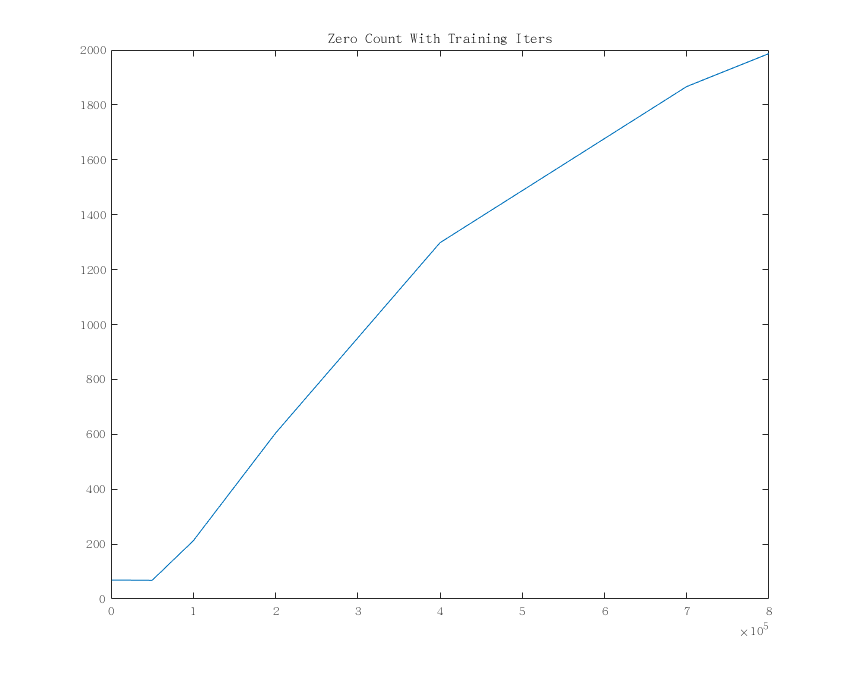
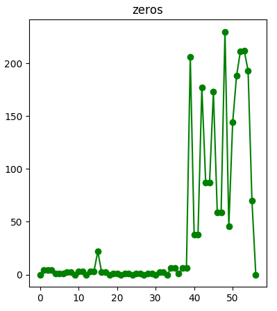
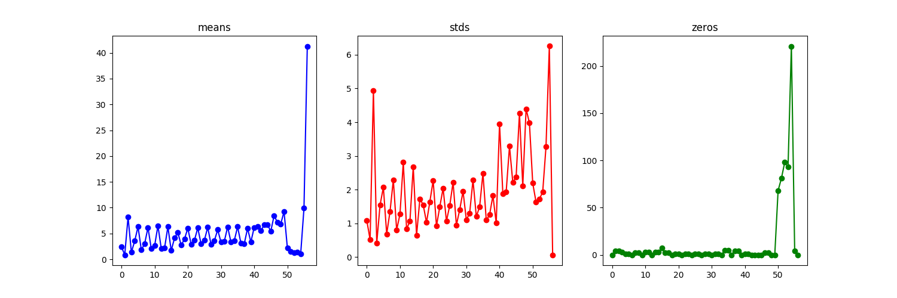
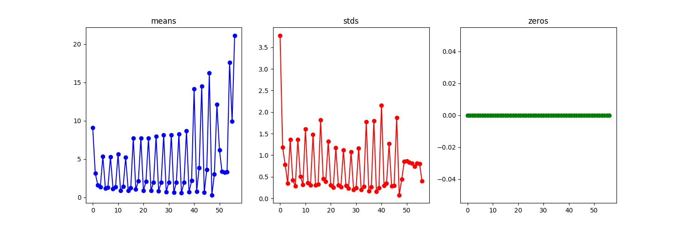
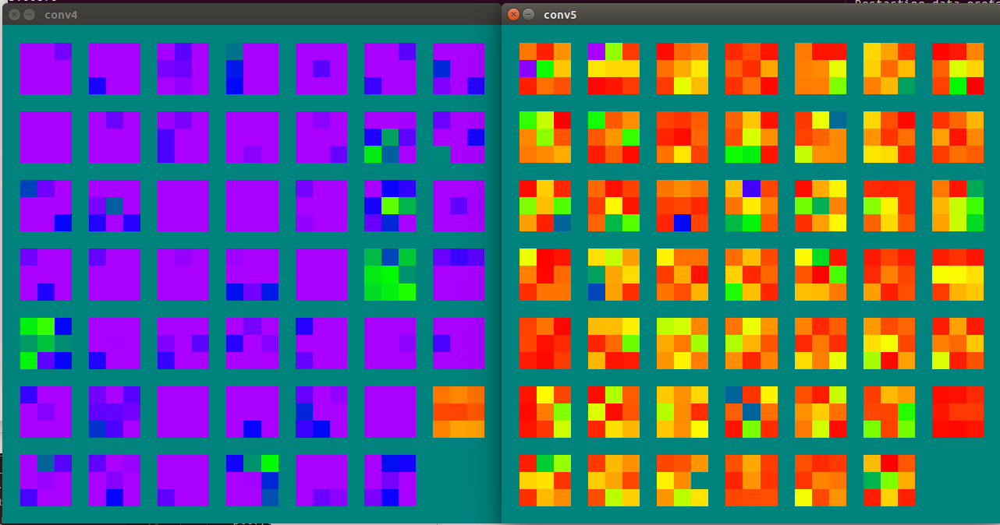
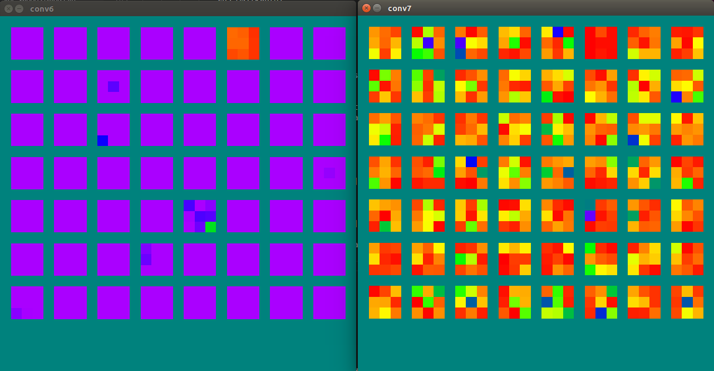
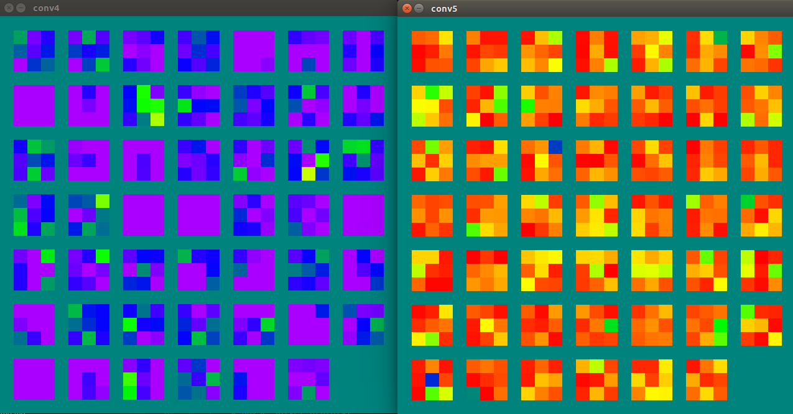

  

这里是对零核现象的观察实验记录.  
具体来说, 就是在训练卷积神经网络的过程中发现模型中有大量卷积核的 L1 变为 0 的情况, 这里为了方便简称零核现象.  
<!--more-->
最初遇到这种问题是在 [DAN](https://github.com/MarekKowalski/DeepAlignmentNetwork) 训练时发现的, 当时觉得是太大学习率, ReLU 死亡, 后面降低了 lr 就没出现过了.  
直到后来做分割观察 [ENet](https://github.com/TimoSaemann/ENet) 的预训练模型时又发现了几百个零核的现象, 而且自己用 ShuffleNet 做的分割网络也出现了非常多零核, 这对模型性能显然是有很大影响的, 所以就下定决心解决这个问题.  
根据之前 DAN 的经验, 我自然先试了一下降低学习率, 结果没用, 虽然零增长的速度变慢了, 但还是会出现, 而且随着训练过程零核几乎线性增加 ( 像上图那样 ).  
把每层的零核数作纵坐标, 层数作横坐标, 打印成曲线出来就是这个样子:  

  
一共 2312 个零核, 简直壮观.  

 

因为零核多集中在 depthwise 卷积上, 所以感觉上可能是由于 depthwise 卷积核太薄, 容易训练时掉坑回不来. 后面在网上也没找到多少关于这个的讨论, 唯一一个是在知乎上 [关于 MobileNet V2 的回答](https://www.zhihu.com/question/265709710/answer/298245276), 也是差不多的解释, 不过我后来去掉了后面所有的 ReLU, 也是得到了很多空核, 也是个迷.  
无奈之下开始各种调超参. 一是把 batch size 加大, 讲道理更新得会稳一些, 然而并没有用, 零核依然会出现. 二是换了优化器, 用回朴素的 SGD momentum. 这时神奇的事情发生了, 不管怎么训练, 怎么调大 lr, 调小 batch size, 零核都没有出现了...

Adam

SGD

最终对比了几个数据集, 从结果上来看 SGD 版比 Adam 版泛化性更强, 性能在个别数据集上也提升很大, 测试指标的标准差更是明显低于 Adam 版的, 做分割出来的边界也变得更加平滑了. 毕竟 Adam 版零核集聚在高层次上, 泛化方面有所缺陷的也是正常的.  

### 后续
后面有空在 mnist 上做了些实验, 发现优化器中只有 Adam 和 RMSProp 肯定会产生零核, 而用其他 SGD, AdaDelta, AdaGrad 都不会产生零核. 既然如此的话, 似乎是可以从 RMSProp 中找到启示的, 但如果要验证还是得具体分析下更新过程才行, 只能暂时留坑了. 

### 接续
好吧, 上一次记录的结果是错误的, 并非只有 Adam 和 RMSProp 肯定会产生零核, 理论上零核的产生依旧是和参数更新的速率密不可分, 所以所有优化方法都可能产生零核. 之所以之前产生错误的结论, 是因为统计零核时采用了 L1 + 阈值 的方法, 而实际上零核表现出来的是并未完全收敛于 0, L1 差均值 10 倍以内, 但相较于其他滤波器而言判别力非常低的情况. 比如下面这种.  
下面是用 AdaGrad 优化一个普通卷积接 depthwise 卷积重复三次的简单网络, 数据集用的 fashion-mnist, 图为其中两层相邻卷积的可视化, 红橙黄绿蓝靛紫, 代表卷积核的绝对值大小, 左边为普通卷积沿通道绝对值叠加得来, 右边为 depthwise 卷积取绝对值得来.  

其后两层

可以看到, 部分卷积核已经几乎一片红了, 对其上层卷积核也产生了影响. 相比之下, SGD 训练的好的情况:

虽然还无法解明什么, 但至少说明了 depthwise 卷积不太好训练, 通过观察训练过程卷积核的变化, 可以看到 SGD + momentum 相对还是比较平稳的, 尽管有些时候可能也会漏网 ( 实际上之前用 MobileNetV2 做分割在 COCO 上预训练也有出现十几个零核... ). 先到这里, 之后一年的时间因为要专心学习, 所以大概要全面搁置了, 可能会整理记录下之前的项目. 就等之后爬上好的平台再说吧.

