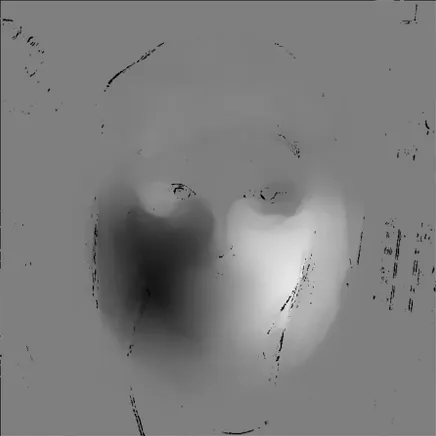
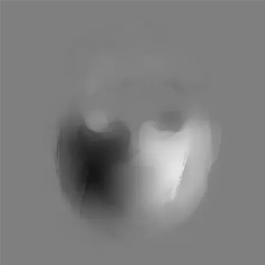

做光流图像时容易出现很多噪点，将重采样后变化较大的部分 mask 掉，就可以得到相对可靠但是有缺失值（nan）的图像：



突发奇想的一种解决方法就是采集每个以缺失点为中心的 32x32、16x16、8x8、4x4、2x2 的区域（还可以更高）的非 nan 均值，这些均值可以看作一个点的运动（由大范围模糊准确值向小范围精确噪声值运动），再直接取均值就能得到考虑了图像连续性的一个较好的估计。得出结果如下：



这种方法好处在于比较好实现，可以考虑带掩码的全局滤波器组的实现方法，效果应该也不错。而且还能扩展，比如用其他先验方法来取区域和值来代表，以及点的运动也可以引入先验知识来估计。不知道一般是怎么处理的，反正直接平滑就够用。

## 朴素实现
```python
import cv2
import copy
import numpy as np


def crop_rect(img, rect, border_mode=cv2.BORDER_CONSTANT, value=0):
    """Crop a rectangle area from image, this allow the area partly outside the image.
    Args:
        img(array):           opencv image
        rect(tuple/array):    tuple of (left, top, right, bottom)
    Outs:
        face_img(array)
        pad_l, pad_t(tuple):  bias of axis origin
    """
    if isinstance(rect, np.ndarray):
        rect_int = np.int64(rect.flatten())
    else:
        rect_int = list(map(int, rect))
    face_lt = rect_int[:2]
    face_rb = rect_int[2:4]
    pad_l = -face_lt[0] if face_lt[0] < 0 else 0
    pad_t = -face_lt[1] if face_lt[1] < 0 else 0
    pad_r = face_rb[0] - img.shape[1] if face_rb[0] > img.shape[1] else 0
    pad_b = face_rb[1] - img.shape[0] if face_rb[1] > img.shape[0] else 0
    pad_img = cv2.copyMakeBorder(
        img, pad_t, pad_b, pad_l, pad_r, border_mode, value=value
    )
    face_img = pad_img[
        face_lt[1] + pad_t : face_rb[1] + pad_t + pad_b,
        face_lt[0] + pad_l : face_rb[0] + pad_l + pad_r,
        :,
    ]
    return face_img, (pad_l, pad_t)


def gradual_mean(raw_array, nan_mask=None, max_window_size=32):
    """
    raw_array:   (H, W, C) array
    nan_mask:    (H, W) array
    """
    assert len(raw_array.shape) == 3
    src_array = copy.deepcopy(raw_array)
    if nan_mask is None:
        nan_mask = np.sum(src_array, axis=-1)
    nan_ys, nan_xs = np.where(np.isnan(nan_mask))
    for cx, cy in zip(nan_xs, nan_ys):
        window_size = max_window_size
        window_mean = []
        while window_size > 1:
            half_l = window_size // 2
            window_rect = (cx - half_l, cy - half_l, cx + window_size, cy + window_size)
            window_img = crop_rect(src_array, window_rect)[0]
            window_mean.append(np.nanmean(window_img, axis=(0, 1)))
            if np.isnan(np.sum(window_mean[-1], axis=-1)):
                break
            window_size = window_size // 2
        window_mean = np.array(window_mean)
        src_array[cy, cx] = window_mean.mean(axis=0)
    return src_array
```

## 向量化实现
用 pytorch 向量化一下可以到 3ms 这样

```python
import copy
import warnings
import numpy as np
import torch
from torch.nn import functional as F


def gradual_mean_pytorch(raw_tensor, max_window_size=33):
    """
    Compute the gradual mean of a tensor using PyTorch functions.
    Args:
        raw_tensor:       a PyTorch tensor of shape (batch_size, channels, height, width)
                        containing the input data
        max_window_size:  an integer specifying the maximum size of the filter window
    Returns:
        raw_tensor_fil:    a PyTorch tensor of the same shape as raw_tensor
                            containing the filtered data
    """

    # 1. Calculate filters window size
    max_iters = int(np.log2(max_window_size - 1))
    window_sizes = np.logspace(1, max_iters, max_iters, base=2, dtype=np.int64) + 1
    if window_sizes[-1] != max_window_size:
        warnings.warn(
            f"max_window_size {max_window_size} is not aligned with max filter size {window_sizes[-1]}",
            UserWarning,
        )

    # 2. Get non-nan tensor and mask
    nan_mask = torch.isnan(raw_tensor)
    valid_mask = torch.logical_not(nan_mask)
    valid_tensor = torch.nan_to_num(raw_tensor, nan=0.0)

    # 3. Smoothen non-nan tensor and mar
    filtered_tensor = torch.cat(
        [
            F.avg_pool2d(valid_tensor, ws, stride=1, padding=ws // 2)
            / F.avg_pool2d(valid_mask.float(), ws, stride=1, padding=ws // 2)
            for ws in window_sizes
        ],
        dim=0,
    )

    # 4. In case there were still nan
    valid_filtered_mask = torch.logical_not(torch.isnan(filtered_tensor))
    valid_filtered_tensor = torch.nan_to_num(filtered_tensor, nan=0.0)

    # 5. Mean merge all filtered tensor
    mean_filtered_tensor = torch.sum(
        valid_filtered_tensor, dim=0, keepdims=True
    ) / torch.sum(valid_filtered_mask, dim=0, keepdims=True)

    # 6. Replace NaN values in the input tensor
    raw_tensor_filtered = copy.deepcopy(raw_tensor)
    raw_tensor_filtered[nan_mask] = mean_filtered_tensor[nan_mask]

    if torch.sum(torch.isnan(raw_tensor_filtered)) > 0:
        print("nan still exist after filtering.")

    return raw_tensor_filtered
```